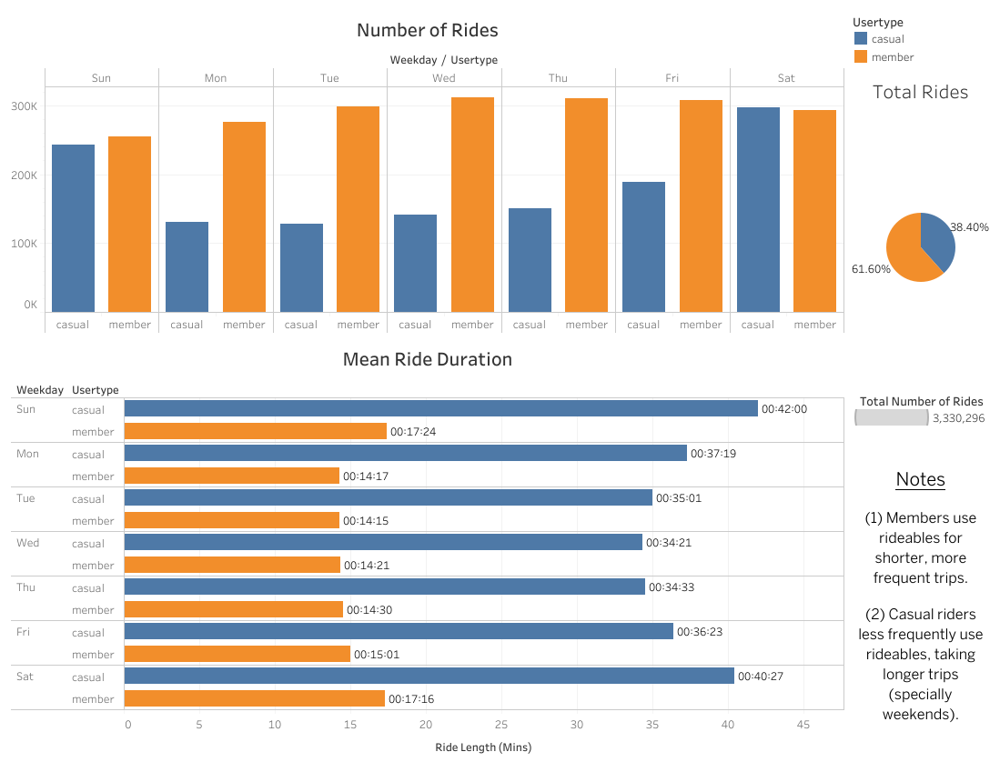

<a name="top"></a>

# Cyclistic Data Analysis 2020 <a href="#the-title" id="the-title"></a>

**By** Cristian Arevalo 

**Last Updated** August 1, 2023

[](#the-title) [](#table-of-contents) [](#about-this-project) [](#top)


## Table of Contents

[](#the-title) [](#about-this-project) [](#top)

- [About This Project](#about-this-project)
- [Introduction](#introduction)
- [Business Task](#business-task)
- [About Data Sources](#about-data-sources)
- [Prep Work](#prep-work)
    * [Step 1: Collect Data](#prep-work-step-1)
    * [Step 2: Wrangle Data and Combine into a Single Table](#prep-work-step-2)
         - [Preliminary Inspection](#preliminary-inspection)
         - [Fixing Column Data Type](#fixing-column-data-type)
         - [Combine Trip Data](#combine-trip-data)
         - [Inspecting Combined Trip Data](#inspecting-combined-trip-data)
    * [Step 3: Clean Up and Add Data to Prepare for Analysis](#prep-work-step-3)
         - [Key Problems and Solutions](#key-problems-and-solutions)
         - [Checking For Missing Data](#checking-for-missing-data)
         - [Checking For Duplicate Data](#checking-for-duplicate-data)
         - [Creating Table About Stations](#creating-table-about-stations)
         - [Cleaning Operations](#cleaning-operations)
         - [Manipulating Data](#manipulating-data)
    * [Step 4: Perform Analysis](#prep-work-step-4)
         - [Cyclistic Weekly Analysis](#cyclistic-weekly-analysis)
         - [Cyclistic Monthly Analysis](#cyclistic-monthly-analysis)
         - [Cyclistic Time of Day Analysis](#cyclistic-time-of-day-analysis)
         - [Cyclistic Rideable Analysis](#cyclistic-rideable-analysis)
         - [Cyclistic Geographic Analysis](#cyclistic-geographic-analysis)
- [Data Summary](#data-summary)


## About This Project

[](#table-of-contents) [](#introduction) [](#top)

This case study is my capstone project for the Google Data Analatics Professional Certificated (via Coursera).

Here, I assume the role of a junior data analyst working in a marketing analyst team at Cylistic, a fictional bike-share company stationed in Chicago based on [Divvy](https://divvybikes.com) bikes. The objective is to understand how casual riders and annual members use Cyclistic bikes differently. These insights will help the marketing team to develop new marketting strategies to convert casual riders into annual members. But first, Cyclistic executives must be compelled with data insights and professional data visualizations.

***Special Notes***: 

All data cleaning and analysis is accomplish through the use of *SQL* in *Google CLoud BigQuery (Sandbox Edition)*. Python is used to upload large datasets (over 10MBs), the rest are manually uploaded through the site from csv files.

The analysis is based on the Divvy case study "'Sophisticated, Clear, and Polished’: Divvy and Data Visualization" written by Kevin Hartman ([found here]( https://artscience.blog/home/divvy-dataviz-case-study))


## Introduction 

[](#about-this-project) [](#business-task) [](#top)


Cyclistic is a bike-share company based in Chicago, USA. In 2016, Cyclistic Launched a successful bike-share program offering bike rentals throughout the city. Since then, the program has expanded to a fleet over 5,800 bicycles that are geotracked and locked into a network of 692 stations across Chicago. The bikes can be unlocked from one station and returned to any other station in the system anytime.

<p align="center">
  
</p>

<p align="center"> <strong> <a href="https://divvybikes.com">Divvy</a> Bikes Stationed in Chicago </strong></p>

Customers are divided into two classes: casual riders (those who purchase either the single-ride or full-day passes) and Cyclistic members (who purchase annual memberships). 

Until now, Cyclistic's marketing strategy relied on building general awareness and appealing to broad consumer segments. The flexible pricing plans (single-ride passes, full-day passes, and annual memberships) aided in bringing in new customers.

Although pricing flexibility helps in attracking new customers, Cyclistic's finance analyst have concluded that annual members are much more profitable than casual riders. The director of marketting (Lily Moreno) believes that increasing the number of annual members will be the key to future growth. Since casual riders have chosen Cyclistic for their mobility needs and are already aware of the annual membership program, a marketing strategy aimed at converting casual riders into members is to be held.

### Business Task

[](#introduction) [](#about-data-sources) [](#top)

The marketing team would like to know:

* How do annual members and casual riders use Cyclistic bikes differently?

* Why would casual riders buy Cyclistic annual memberships?

* How can Cyclistic use digital media to influence casual riders to become members?

Specifically, my focus will revolve around on ***how do annual members and casual riders use Cyclistic bikes differently***.

## About Data Sources

[](#business-task) [](#prep-work) [](#top)

* Historical trip data is publicly available [here](https://divvy-tripdata.s3.amazonaws.com/index.html) (Note: The datasets have different names because Cyclistic is a fictional company).

* The data has been made available by Motivate International Inc. under this [liscense](https://ride.divvybikes.com/data-license-agreement).

* Data is reliable, original, comprehensive, and cited. Since only trips occuring in 2020 are studied, the data is not current. **It mostly ROCCCs**! However, it is **not** adviseable to make full business decisions based on this data.
  - For business decisions, it is recommended to use current data (from 2022/23). 

* The data collected contains ride ids, rideable type, start/end timestamps, station names & ids, latitude & longitude, and usertype. Overall, 13 parameters.


## Prep Work

[](#about-data-sources) [](#prep-work-step-1)[](#top)

The data is downloaded, skimmed, prepared, cleaned, and manipulated. This section deals with all the dirty work prior to the actual analysis and visualization. The prep-work lays the foundation of our data problem solving, and takes more than twice the time and effort as the analysis.

If you are more interested with the analysis, and results, you can jump ahead to [Data Summary](#data-summary).

### Step 1: Collect Data <a href="#prep-work-step-1" id="prep-work-step-1"></a>

[](#prep-work) [](#prep-work-step-2) [](#top)

* Download Divvy datasets containing all trip data occuring in 2020 (Jan-Dec).

* Uploaded Divvy datasets (csv files) individuall through browser in Google Cloud BigQuery (Sandbox).

* Files that were too large were uploaded via this python script ([shown here](python-code/upload_df_to_gbq_v5.py)).


### Step 2: Wrangle Data and Combine into a Single Table <a href="#prep-work-step-2" id="prep-work-step-2"></a>

[](#prep-work-step-1) [](#preliminary-inspection) [](#prep-work-step-3) [](#top)

#### Preliminary Inspection

[](#prep-work-step-2) [](#fixing-column-data-type) [](#prep-work-step-3) [](#top) [](#prep-work-step-2) 

Once data is uploaded, it is important to compare schemas (e.g. column names and data type) for each of the tables and inspect the tables through preview to look for incongruencies. Here are the results:

* Though column names matched, column types differed accross tables.

  - The reason being that I did not format the dataframe in python prior to uploading (useful for the future).

* From Jan 2020 to Nov 2020, station ids were purely numeric. On Dec 2020, alphanumeric station ids were added; however, on several occasions their previous numeric ids were also used.

  - It is necessary to change data type for station ids from INT64 to STRING.

  - There is also a need for new and unique ids for the stations.

#### Fixing Column Data Type

[](#preliminary-inspection) [](#combine-trip-data) [](#prep-work-step-3) [](#top) [](#prep-work-step-2) 

The following query is ran for multiple tables to correct column types.

```sql
CREATE OR REPLACE TABLE `project.dataset.table` AS (
  SELECT * REPLACE (
    CAST(started_at AS TIMESTAMP) AS started_at, 	
    CAST(ended_at AS TIMESTAMP) AS ended_at, 
    CAST(start_station_id AS STRING) AS  start_station_id, 
    CAST(end_station_id AS STRING) AS end_station_id 
    )
  FROM `project.dataset.table`);
```

#### Combine Trip Data

[](#fixing-column-data-type) [](#inspecting-combined-trip-data) [](#prep-work-step-3) [](#top) [](#prep-work-step-2) 

The bike trip data is divided into 10 tables, however we interested in looking at all rides occuring during 2020. 

The following query is used to create a new table, called **divvy_trips_2020** for reference, containing all trip data occuring in 2020 is created.
* Additionally, this query makes use of naming conventions (specifically, *similar names*) to combine all data from 2020 into a single table.

```sql
CREATE TABLE IF NOT EXISTS `case-study1-bike-share.divvy_trips_2020_analysis.divvy_trips_2020`
SELECT * FROM `case-study1-bike-share.divvy_trips_2020_data.divvy_trips_2020_*`;
```

#### Inspecting Combined Trip Data

[](#combine-trip-data) [](#prep-work-step-3) [](#prep-work-step-3) [](#top) [](#prep-work-step-2) 

Briefly skiming the new table shows that:

- Column names and type look great (they match).

- Station names and ids need to be checked for duplicates (to remove them).

- There is no trip duration among the columns to compare casual riders with members (there is a need to create the field and scrutinized it for abnormal ride lengths).

- Check for distinct values across columns (all good here: 2 usertypes, 3 ridable types; station information needs to be verified seperatly, latitude and longitude values are not unique per station).

There is still a need to check for nulls or missing values.


### Step 3: Clean Up and Add Data to Prepare for Analysis <a href="prep-work-step-3" id="prep-work-step-3"></a>

[](#inspecting-combined-trip-data) [](#key-problems-and-solutions) [](#prep-work-step-4) [](#top) [](#prep-work-step-2) 

#### ***Key Problems and Solutions***


[](#prep-work-step-3) [](#checking-for-missing-data) [](#prep-work-step-4) [](#top) [](#prep-work-step-3) 

The first part of tidying data is look for issues/concerns regarding the data. Here are some of them:

1. Some station names can have more than one id.
    * *Create* new unique station ids.
    
    * Prior to December ids were unique intergers, afterward alphanumeric ids were added but old ids were still being used.

    * The result, the station id is sometimes in accordance with the previous data, at times missing, and at others a combination of alphanumeric characters.

1. Some station names have duplicates that end with a word or symbol in parathesis.

    * *Establish* a single unique name per station.
  
    * There are two sources of duplicates: those that end with "(*)" and those that end with "(Temp)".

1. There are some station names that corresponds to quality checks or other.
    * *Filter* these stations when interest on insights only about customers

    * Relevant NEW IDS: 310, 311, 312, 631, 455, and 45

      - HQ QR (id=310)
      - Hubbard st bike checking (Lbs-wh-test) (id=311)
      - Hubbard_test_lws (id=312)
      - Watson Testing-divvy (id=633)
      - Base-2132 W Hubbard Warehouse (id=45)
      - Mt1-Eco5.1-01 (id=455)

1. The data can only be aggregated at the ride-level, which is too granular.
    * *Add additional columns* of data, such as the **weekday** & **month** when trips begin. This provide additional opportunities to aggregate the data.

1. There is no field measuring *trip duration*.
    * *Create* a new column indicating **ride_length** and *Scrutinize* ride duration.
  
    * This presents more opportunities to compare user behavior between casual and member riders.

1. Additionally, there are some rides were trip durations are negative.
    * *Remove* bad data.
    
    * This includes several hundred rides where Divvy took bikes out of circulation for Quality Control reasons.

    * This may also correspond to early cancellation times of rides by users.
  
1. Some crucial data is missing in columns with Null values.
    * These instances are represented by Null values and it is important to be aware of them for data cleaning.

#### Checking For Missing Data

[](#key-problems-and-solutions) [](#checking-for-duplicate-data) [](#prep-work-step-4) [](#top) [](#prep-work-step-3) 

First order of business is finding out if anything important is missing from the data, so we *check* which columns contain NULLS using the following query.
* The source for the following query comes from [stackoverflow](https://stackoverflow.com/questions/58716640/bigquery-check-entire-table-for-null-values)

```sql
SELECT column_name, COUNT(1) AS nulls_count
FROM `case-study1-bike-share.divvy_trips_2020_analysis.divvy_trips_2020` as table1,
UNNEST(REGEXP_EXTRACT_ALL(TO_JSON_STRING(table1), r'"(\w+)":null')) column_name
GROUP BY column_name
ORDER BY nulls_count DESC
```

**Results**

After checking for nulls or missing data, we discover that some important information is missing from the trips: *start/end station names & ids*. 
* Without this information we can't track the trips, which means we need to *remove these instances*. Before proceeding to do delete rows, we need to identify if there is anything else we need look out for when cleaning the data.

The table below showcases which columns have missing information and how many rows are missing. 

| column_name	       | nulls_count  |
| :----------        | ----------:  |
| end_station_id     | 111342       |
| end_station_name   | 110881       |
| start_station_id   | 95282        |
| start_station_name | 94656        |
| end_lat            | 4255         |
| end_lng            | 4255         |


#### Checking For Duplicate Data 

[](#checking-for-missing-data) [](#creating-table-about-stations) [](#prep-work-step-4) [](#top) [](#prep-work-step-3) 

A common problem often encounter while cleaning data is *duplicate names*, which we'll tackle in this section. Specifically, we will be looking for duplicate station names or multiple ids for one station using the following query.

```sql
WITH all_stations AS (
  SELECT start_station_name, start_station_id, end_station_name, end_station_id
  FROM `case-study1-bike-share.divvy_trips_2020_analysis.divvy_trips_2020` 
)
SELECT DISTINCT station_name, station_id
FROM ( (SELECT DISTINCT start_station_name AS station_name, start_station_id AS station_id FROM all_stations)
UNION ALL (SELECT DISTINCT end_station_name AS station_name, end_station_id AS station_id FROM all_stations)
)
GROUP BY station_name, station_id
ORDER BY station_name
```

**Results**

After querying a list of stations with their respective ids, the outcome is downloaded as a csv file to view in EXCEL (unfortunately, some station names were cut off when viewing the table in BigQuery). 
* A quick and up-close inspection confirms the source of duplicate data: "(*)" and "(Temp)". 

* Additionally, multiple ids are often found for the same station.

Below are two primary examples showcasing duplicates by either having the different ids or names.

| station_name | station_id |
| :----------- | ---------: | 
| Damen Ave & Walnut (Lake) St | 656 |
| Damen Ave & Walnut (Lake) St | KA17018054 |
| Damen Ave & Walnut (Lake) St (*) | 656 |
| Wentworth Ave & Cermak Rd | 120 | 
| Wentworth Ave & Cermak Rd	| 13075 |
| Wentworth Ave & Cermak Rd (Temp)	| 120 |


#### Creating Table About Stations

[](#checking-for-duplicate-data) [](#cleaning-operations) [](#prep-work-step-4) [](#top) [](#prep-work-step-3) 

Due to the present duplicate data occuring in start & end stations, there is a need to fix the problem to not have excess information and be concise. A way to address these stations is by creating a new table as a list of station information. The desired parameters will be **station_name**, **station_id**, **lat**, **lng**, and later down the line we will add the number of users per *member_casual* as **member_riders** and **casual_riders** (to display overall station activity for marketing purposes).

A summary of the steps taken to create a new table showcasing the station info is presented below (meanwhile, the full query will be available [here](sql-queries/step-2_9-create-divvy_station_2020.sql)):


1. The new table will be called *divvy_stations_2020*.

1. We begin by identifying unique station names from start & end station names, fixing duplicates to only present unique station names.

1. Then, we create unique station ids that correspond to only one station.

1. Finally, we average the latitude and longitude values of all ride trips corresponding to the stations to determine the **lat** and **lng** geo-location of each station.

    * Now that we have the most basic station information, we need consider the trip data from 2020 where we notice that the geo-location can be different for the same station.

    * Latitude / Longitude values for the stations are included in the same row as each ride’s information. Since each bike has its own GPS device, there is slight variance in the lat/long values of every station per ride. However, each station can only have one unique geo-location, so we take mean value for all respective lat/long values of a station.
  
    * These values are then used to replaced the start and end station lat/long values for each ride.

**Results**

The full table is available here: [cleaned](tables/divvy_stations_2020_cleaned.csv) and [uncleaned](tables/divvy_stations_2020_uncleaned.csv). Below are the first 5 results.

| station_name               | station_id | lat                | lng                 |
| -------------------------- | ---------- | ------------------ | ------------------- |
| 2112 W Peterson Ave        | 1          | 41.991161729691882 | -87.683592172455633 |
| 63rd St Beach              | 2          | 41.781052497804261 | -87.57612809187053  |
| 900 W Harrison St          | 3          | 41.8747676018918   | -87.649804773961    |
| Aberdeen St & Jackson Blvd | 4          | 41.877720779404484 | -87.654792138860145 |
| Aberdeen St & Monroe St    | 5          | 41.880414761538468 | -87.655516799346827 |
| Aberdeen St & Randolph St  | 6          | 41.884114663376479 | -87.654270784691533 |


#### Cleaning Operations

[](#creating-table-about-stations) [](#manipulating-data) [](#prep-work-step-4) [](#top) [](#prep-work-step-3) 

Now that we have established a solid foundation of information about each station, we will use this data (station_name, station_id, lat, lng) to replace the trips corresponding information about start & end stations. The full query is available [here](sql-queries/step-3-cleaning-and-adding-data.sql) and the verification of the results is available [here](sql-queries/step-3_5-verifying-clean-data.sql), however below I will discussion a brief overview of the steps taken.

1. The goal of this new query is to create a new version of *divvy_trip_data* (*v2*), where certain cases are excluded, to make analysis of the trip data easier.

1. Rides are removed when:
    - Station names are missing (meaning they are NULL) from *start* or *end station names* because **these rides cannot be tracked**.
        * The new station ids will be assigned based on their station names. 
  
    - Trip durations that are less than 60 seconds because **these *ride lengths* are similar to a false start**.
        * Moreover, the first minute of all rides are charged a fix fee (even if rides are less than a minute).
  
    - Trip durations are greater than 24 hours because **Cyclistic bikes are expected to be returned to an appropriate station once they are no longer being used**.
        * Keeping a bike longer than a day is synonymous to stealing it and such cases result in an additional fee.

1. Station names are altered to prevent duplicate names.
    - Duplicates end with a word or symbol in parathesis.
  
    - This makes implementing new station ids smoother.
  
1. Using **divvy_stations_2020**, station information is updated for both *start & end stations*.
    - Specifically, the following parameters are updated (8 parameters total):
      
        * Station name
        * Station id
        * Starting latitude
        * Startting longitude

1. Additional data is added to aggregate trip info more easily during analysis
    - The following fields of data are implemented:
      
        * Starting month number (1-12) as **month_num**
        * Starting month name as **starting_month**
        * Starting day of the week (number) as **weekday_num** [1-7]
        * Starting day of the week as **weekday** [Sun-Sat]
        * Trip duration as **ride_length** measured in seconds

**Results**

| ride_id          | rideable_type | started_at                     | ended_at                       | start_station_name           | start_station_id | end_station_name           | end_station_id | start_lat          | start_lng           | end_lat            | end_lng             | member_casuaL | month_num | starting_month | weekday_num | weekday | ride_length |
| ---------------- | ------------- | ------------------------------ | ------------------------------ | ---------------------------- | ---------------- | -------------------------- | -------------- | ------------------ | ------------------- | ------------------ | ------------------- | ------------- | --------- | -------------- | ----------- | ------- | ----------- |
| 99C72397983C1DF5 | docked_bike   | 2020-08-10 23:49:04.000000 UTC | 2020-08-11 12:49:16.000000 UTC | Lake Park Ave & 35th St      | 351              | Lake Park Ave & 35th St    | 351            | 41.831275652901688 | -87.6087894057451   | 41.831275652901688 | -87.6087894057451   | casual        | 8         | Aug            | 2           | Mon     | 46812       |
| 08306A0B4F8B9C44 | docked_bike   | 2020-08-10 23:49:04.000000 UTC | 2020-08-11 00:56:14.000000 UTC | Lake Park Ave & 35th St      | 351              | Lake Park Ave & 35th St    | 351            | 41.831275652901688 | -87.6087894057451   | 41.831275652901688 | -87.6087894057451   | casual        | 8         | Aug            | 2           | Mon     | 4030        |
| 7A3E9EC138E2D0AD | docked_bike   | 2020-08-10 23:49:17.000000 UTC | 2020-08-11 00:18:37.000000 UTC | Stockton Dr & Wrightwood Ave | 586              | Kedzie Ave & Milwaukee Ave | 333            | 41.931312260664328 | -87.638733542147918 | 41.929576232244784 | -87.707870112443771 | casual        | 8         | Aug            | 2           | Mon     | 1760        |
| 5858B7C1FC4A89A2 | docked_bike   | 2020-08-10 23:49:28.000000 UTC | 2020-08-11 00:57:04.000000 UTC | Lake Park Ave & 35th St      | 351              | Lake Park Ave & 35th St    | 351            | 41.831275652901688 | -87.6087894057451   | 41.831275652901688 | -87.6087894057451   | casual        | 8         | Aug            | 2           | Mon     | 4056        |
| CDF2EA7B3F5ED5FF | docked_bike   | 2020-08-10 23:49:48.000000 UTC | 2020-08-11 00:39:13.000000 UTC | Halsted St & 59th St         | 286              | Halsted St & 59th St       | 286            | 41.787533838414639 | -87.644880773373984 | 41.787533838414639 | -87.644880773373984 | casual        | 8         | Aug            | 2           | Mon     | 2965        |


**Verified**

Number of quality check uses in cleaned trip data

| member_casual | quality_check_users |
| ------------- | ------------------- |
| casual        | 71                  |
| member        | 197                 |

From the following stations:

| station_name                           | station_id |
| -------------------------------------- | ---------- |
| Base - 2132 W Hubbard Warehouse        | 45         |
| HQ QR                                  | 310        |
| Hubbard St Bike Checking (Lbs-Wh-Test) | 311        |
| Hubbard_Test_Lws                       | 312        |
| Mtl-Eco5.1-01                          | 455        |
| Watson Testing - Divvy                 | 633        |


#### Manipulating Data

[](#cleaning-operations) [](#prep-work-step-4) [](#prep-work-step-4) [](#top) [](#prep-work-step-3) 

After the cleaning operation, our data is nearly ready for analysis. But before that, we manipulate it to ease our analysis.
* The total number of members and casual riders visiting any station holds potential in identifying key differences among Cyclistic users. We can figure out the total rides from starting and ending stations by grouping data and counting the rows like this [query](sql-queries/step-3_9-manipulating-data.sql).

**Results: Top 5 Starting Stations**

| station_name             | station_id | lat                | lng                 | total_rides_from | total_rides_to | members_from_st | casuals_from_st | members_to_st | casuals_to_st |
| ------------------------ | ---------- | ------------------ | ------------------- | ---------------- | -------------- | --------------- | --------------- | ------------- | ------------- |
| Clark St & Elm St        | 135        | 41.902963895113132 | -87.631312305029311 | 31012            | 31180          | 19886           | 11126           | 20565         | 10615         |
| Kingsbury St & Kinzie St | 345        | 41.889192992430722 | -87.638501411531365 | 21882            | 21337          | 16260           | 5622            | 16454         | 4883          |
| St. Clair St & Erie St   | 564        | 41.894421578032492 | -87.622700546409931 | 21188            | 23853          | 15559           | 5629            | 17410         | 6443          |
| Dearborn St & Erie St    | 208        | 41.894004025551475 | -87.629318830077878 | 23559            | 24134          | 15453           | 8106            | 16039         | 8095          |
| Broadway & Barry Ave     | 56         | 41.937610986894825 | -87.644098303068489 | 23167            | 24057          | 15372           | 7795            | 15787         | 8270          |


### Step 4: Perform Analysis <a href="#prep-work-step-4" id="prep-work-step-4"></a>

[](#manipulating-data) [](#cyclistic-weekly-analysis) [](#data-summary) [](#top) [](#prep-work-step-3) 

Now that the preliminary work is done we can begin conducting a detailed analysis on the data. But first we need to recall the goal: *to discover **how do annual members and casual riders use Cyclistic bikes differently***. The full query used for performing analysis is provided [here](sql-queries/step-4-conduct-analysis).

Specifically, we are interested in analyzing user behavior in the following ways:

1. Weekly

1. Monthly

1. Time of day

1. Type of rideable

1. And geographically

#### Cyclistic Weekly Analysis
Riders behave very different based on weekly trips. During the weekly analysis, we scrutinize the following parameters:

* Usertype (member / casual)

* Weekday (number [1-7] & day [Sun-Sat])

* Average ride length (in secs & time duration)

* Max ride length

* Minimum ride length

* Number of rides

* And part of total rides 

**Resulting Table**

This table is available for [download here](tables/analysis_of/ride_data_by_weekday.csv).

| member_casual | weekday_num | weekday | avg_ride_len_secs | avg_ride_len | max_ride_len | min_ride_len | num_rides | part_of_tot_rides    |
| ------------- | ----------- | ------- | ----------------- | ------------ | ------------ | ------------ | --------- | -------------------- |
| casual        | 1           | Sun     | 2520              | 00:42:00     | 23:55:54     | 00:01:01     | 242713    | 0.072880308537139046 |
| casual        | 2           | Mon     | 2239              | 00:37:19     | 23:59:49     | 00:01:01     | 131039    | 0.039347553490740761 |
| casual        | 3           | Tue     | 2101              | 00:35:01     | 23:54:26     | 00:01:01     | 127485    | 0.038280381083243054 |
| casual        | 4           | Wed     | 2061              | 00:34:21     | 23:57:59     | 00:01:01     | 141395    | 0.04245718698878418  |
| casual        | 5           | Thu     | 2073              | 00:34:33     | 23:48:04     | 00:01:01     | 150913    | 0.045315191202223465 |
| casual        | 6           | Fri     | 2183              | 00:36:23     | 23:58:33     | 00:01:01     | 188455    | 0.056588063043044826 |
| casual        | 7           | Sat     | 2427              | 00:40:27     | 23:59:54     | 00:01:01     | 296754    | 0.089107394658012387 |
| member        | 1           | Sun     | 1044              | 00:17:24     | 23:29:04     | 00:01:01     | 254494    | 0.076417831928453209 |
| member        | 2           | Mon     | 857               | 00:14:17     | 23:17:37     | 00:01:01     | 276207    | 0.082937672807462157 |
| member        | 3           | Tue     | 855               | 00:14:15     | 23:56:39     | 00:01:01     | 298331    | 0.089580926139898681 |
| member        | 4           | Wed     | 861               | 00:14:21     | 23:39:52     | 00:01:01     | 311855    | 0.093641826432245057 |
| member        | 5           | Thu     | 870               | 00:14:30     | 23:46:15     | 00:01:01     | 310516    | 0.093239760069375219 |
| member        | 6           | Fri     | 901               | 00:15:01     | 23:52:08     | 00:01:01     | 307400    | 0.092304107502756513 |
| member        | 7           | Sat     | 1036              | 00:17:16     | 23:59:43     | 00:01:01     | 292739    | 0.087901796116621467 |


#### Cyclistic Monthly Analysis
Riders also behave very differently based on monthly trips. During the monthly analysis, we scrutinize the following parameters:

* Usertype (member / casual)

* Month (number [1-12] & day [Jan-Dec])

* Average ride length (in secs & time duration)

* Max ride length

* Minimum ride length

* Number of rides

* And part of total rides 

**Resulting Table**


This table is available for [download here](tables/analysis_of/ride_data_by_month.csv).

| member_casual | month_num | starting_month | avg_ride_len_secs | avg_ride_len | max_ride_len | min_ride_len | num_rides | part_of_tot_rides     |
| ------------- | --------- | -------------- | ----------------- | ------------ | ------------ | ------------ | --------- | --------------------- |
| casual        | 1         | Jan            | 2273              | 00:37:53     | 23:48:04     | 00:01:05     | 7678      | 0.002305500772303723  |
| casual        | 2         | Feb            | 2364              | 00:39:24     | 23:55:55     | 00:01:06     | 12206     | 0.0036651396752721077 |
| casual        | 3         | Mar            | 2474              | 00:41:14     | 23:53:10     | 00:01:01     | 24418     | 0.0073320809922000924 |
| casual        | 4         | Apr            | 2372              | 00:39:32     | 23:58:33     | 00:01:01     | 23331     | 0.0070056835788770725 |
| casual        | 5         | May            | 2678              | 00:44:38     | 23:53:20     | 00:01:01     | 85914     | 0.0257977068705004    |
| casual        | 6         | Jun            | 2554              | 00:42:34     | 23:55:42     | 00:01:01     | 152794    | 0.045880005861340854  |
| casual        | 7         | Jul            | 2686              | 00:44:46     | 23:58:54     | 00:01:01     | 265559    | 0.079740359415499409  |
| casual        | 8         | Aug            | 2273              | 00:37:53     | 23:59:49     | 00:01:01     | 277794    | 0.083414207025441583  |
| casual        | 9         | Sep            | 1961              | 00:32:41     | 23:59:33     | 00:01:01     | 212041    | 0.063670316392296658  |
| casual        | 10        | Oct            | 1692              | 00:28:12     | 23:59:54     | 00:01:01     | 120624    | 0.03622020384974789   |
| casual        | 11        | Nov            | 1763              | 00:29:23     | 23:55:03     | 00:01:01     | 72106     | 0.021651528873109178  |
| casual        | 12        | Dec            | 1436              | 00:23:56     | 23:41:27     | 00:01:01     | 24289     | 0.0072933456965987411 |
| member        | 1         | Jan            | 652               | 00:10:52     | 23:20:02     | 00:01:01     | 134865    | 0.040496400319971558  |
| member        | 2         | Feb            | 666               | 00:11:06     | 23:52:08     | 00:01:01     | 125383    | 0.037649205956467535  |
| member        | 3         | Mar            | 784               | 00:13:04     | 23:41:42     | 00:01:01     | 114351    | 0.034336587498528658  |
| member        | 4         | Apr            | 1094              | 00:18:14     | 23:56:39     | 00:01:01     | 60215     | 0.018080975384770603  |
| member        | 5         | May            | 1172              | 00:19:32     | 23:29:04     | 00:01:01     | 111415    | 0.03345498418158626   |
| member        | 6         | Jun            | 1107              | 00:18:27     | 23:46:15     | 00:01:01     | 184961    | 0.055538907052105881  |
| member        | 7         | Jul            | 1050              | 00:17:30     | 23:52:12     | 00:01:01     | 276113    | 0.082909447088186761  |
| member        | 8         | Aug            | 980               | 00:16:20     | 22:05:05     | 00:01:01     | 318269    | 0.0955677813623774    |
| member        | 9         | Sep            | 901               | 00:15:01     | 22:59:48     | 00:01:01     | 279042    | 0.083788948489863971  |
| member        | 10        | Oct            | 830               | 00:13:50     | 23:59:43     | 00:01:01     | 211750    | 0.063582936771986634  |
| member        | 11        | Nov            | 811               | 00:13:31     | 23:36:24     | 00:01:01     | 147124    | 0.044177454496537247  |
| member        | 12        | Dec            | 748               | 00:12:28     | 22:49:28     | 00:01:01     | 88054     | 0.026440292394429805  |


#### Cyclistic Time of Day Analysis
Riders appear to follow notable trends based on the start of their trips. During the monthly analysis, we scrutinize the following parameters:

* Usertype (member / casual)

* Weekday (number [1-7] & day [Sun-Sat])

* Time of day (in hours)

* Number of rides

* And part of total rides 

**Resulting Table**

This table is available for [download here](tables/analysis_of/ride_data_by_weekday_and_time_of_day.csv).

| member_casual | weekday_num | weekday | time_of_day | num_rides | part_of_tot_rides      |
| ------------- | ----------- | ------- | ----------- | --------- | ---------------------- |
| casual        | 1           | Sun     | 0           | 5504      | 0.0016527059456576832  |
| casual        | 1           | Sun     | 1           | 3812      | 0.0011446429987004157  |
| casual        | 1           | Sun     | 2           | 2264      | 0.00067981945148419239 |
| casual        | 1           | Sun     | 3           | 1176      | 0.00035312176455185967 |
| casual        | 1           | Sun     | 4           | 714       | 0.00021439535704934336 |
| casual        | 1           | Sun     | 5           | 591       | 0.00017746170310386825 |
| casual        | 1           | Sun     | 6           | 1128      | 0.000338708631304845   |
| casual        | 1           | Sun     | 7           | 1912      | 0.0005741231410060848  |
| casual        | 1           | Sun     | 8           | 3546      | 0.0010647702186232094  |
| casual        | 1           | Sun     | 9           | 6924      | 0.0020790944708818674  |
| casual        | 1           | Sun     | 10          | 11461     | 0.0034414358363340676  |
| casual        | 1           | Sun     | 11          | 17117     | 0.0051397833706072977  |
| casual        | 1           | Sun     | 12          | 20244     | 0.0060787389469284412  |
| casual        | 1           | Sun     | 13          | 23164     | 0.0069555378861218342  |
| casual        | 1           | Sun     | 14          | 24292     | 0.0072942465174266795  |
| casual        | 1           | Sun     | 15          | 24548     | 0.0073711165614107578  |
| casual        | 1           | Sun     | 16          | 22629     | 0.0067948915051394831  |
| casual        | 1           | Sun     | 17          | 19534     | 0.0058655446843163487  |
| casual        | 1           | Sun     | 18          | 16201     | 0.0048647327444767676  |
| casual        | 1           | Sun     | 19          | 12597     | 0.0037825466565134152  |
| casual        | 1           | Sun     | 20          | 9089      | 0.0027291868350440922  |
| casual        | 1           | Sun     | 21          | 5993      | 0.0017995397406116453  |
| casual        | 1           | Sun     | 22          | 4722      | 0.001417891983175069   |
| casual        | 1           | Sun     | 23          | 3551      | 0.0010662715866697735  |
| casual        | 2           | Mon     | 0           | 2210      | 0.0006636046765813009  |
| ...        | ...           | ...     | ...           | ...       | ... |


#### Cyclistic Rideable Analysis
Riders have a higher tendency to use certain rideable types than others. This analysis aims to ascertain which rideables are more favored. During the analysis we look out for the following parameters:

* Rideable Type (classic / docked / electric bikes)

* Usertype (member / casual)

* Number of rides

* And part of total rides

**Resulting Table**

This table is available for [download here](tables/analysis_of/ride_data_by_rideable.csv)

| rideable_type | member_casual | num_rides | part_of_tot_rides     |
| ------------- | ------------- | --------- | --------------------- |
| classic_bike  | casual        | 11158     | 0.0033504529327122875 |
| classic_bike  | member        | 58496     | 0.017564805050361891  |
| docked_bike   | casual        | 1125692   | 0.33801559981455104   |
| docked_bike   | member        | 1784073   | 0.53571003898752545   |
| electric_bike | casual        | 141904    | 0.042610026255924395  |
| electric_bike | member        | 208973    | 0.062749076958924968  |


#### Cyclistic Geographic Analysis
Members and casual riders concentrate their trips on different destinations.


## Data Summary

The data can be summarized as below:

* Total number of stations is **683**.

* Out 3.54 million rows of trip data, **3.3 million rides** remain.
    - Trips without a *start* or *end station name* are removed because without station names we can't track the trips. Additionally, this information is used to assign new station ids.

    - Trips less than a min are also removed because they can be considered a false start of sorts. Moreover, the price is set for all rides within a minute.

    - Trips more than a day are removed because all rideables must be returned after they are used. Rides longer than a day can be considered stolen and users are even charged an additional fee for such cases.

* Out of the 3.54 million rides, **61.6%** were taken by subscribers and **38.4%** were taken by casual customers

* Average ride duration for a casual biker is **46 minutes** long, meanwhile the average ride length for a member is **12 minutes** long.

**Table: Summary of Trips**

| summary_of | started_with | ended_with | eliminated | retained (%) |
| ---------- | ------------ | ---------- | ---------- | ------------ |
| rides      | 3,541,683    | 3,330,296  | 211,387    | 94.031 |
| stations   | 696          | 683        | 13         | 98.132 |


**Table: Summary of Riders**

| member_casual | num_riders   | percent  | avg_ride  |
| ------------- | ----------   | -------  | --------  |
| casual        | 1,278,754    | 38.40    | 37:55     |
| member        | 2,051,542    | 61.60    | 15:15     |


### Cyclistic Weekday Analysis

For the full interactive dashboard visit [here](https://public.tableau.com/views/CyclisticWeekdayAnalysis/Dashboard1?:language=en-US&:display_count=n&:origin=viz_share_link)




<a class="top-link hide" href="#top">↑</a>

[](#top)


<!--------------------------------------[Buttons]------------------------------------------------>
[Previous Button]: images/buttons/previous-button.png
[Next Button]: images/buttons/next-button.png
[Next Heading Button]: images/buttons/next-next-button3.png

[Previous Button2]: 
[Next Button2]: 
[Next Heading Button2]:  


   


