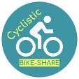

<h1 style="display: none">My Case Studies</h1>

Please visit my website below, where I showcase the same content from this repository but on a more user friendly level.

    
        <a href="https://csarevalo.github.io/Case-Studies/" class="btn" style="margin: 0; padding: 0.6rem 0.9rem;"><strong>My Case Studies</strong></a>
    

# **Welcome to My Case Studies** 👋

A collection of currently available data analysis and case studies.

    
    

 

> **Below you will find those currently available. I intend to add more in the future.**

<!-- ## [**Cyclistic Case Study 2020**](Cyclistic-Data-Analysis-2020) -->

## <a href="Cyclistic-Data-Analysis-2020" style="color: #159957; text-decoration: none;"><strong> Cyclistic Case Study (2020)</strong></a>

**Description:** An insightful analysis exploring the distinct behaviors of Cyclistic Bikeshare program users, aimed at informing strategic business decisions based on reliable data.

**Overview:** Delve into the nuanced behaviors exhibited by cyclists, uncovering invaluable insights to drive informed business decisions. From understanding user patterns to optimizing customer conversion into loyal members, this analysis promises to pave the way for enhanced profitability and sustainable growth.

